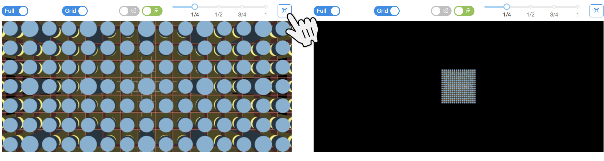

# VERAViewer

VERAViewer is a standalone HTML file that can act as an application to visualize your VERAin XML files.

## Getting started

Double-click `VERAViewer.html` to open it in your default browser.

Click on the [+] button or the main window image to load the VERAin XML file you want to visualize.

After a pause while your file is loaded, the left menu will list all the components in your input file. Choose different items to see that component visualized in the main window, in 2D or 3D.

## Menu Items

Click the `CASL` logo to show and hide the left bar with its menu. Each item with a down arrow can be expanded by clicking.

The simplest items are at the bottom, so let's start there.

### Colors

Each material used is assigned a unique color. A few standard colors are pre-assigned, like blue for the moderator, yellow for helium, and grays for steels and zirconium. Other materials are assigned a color from a palette as they are encountered.

Each material can be hidden wherever it is used in the 3D view with the on/off toggle next to the material name.

### Cell Types

Each cell used in an assembly is listed here. Click on the cell name or picture to see it in the main view. It can be viewed in 2D or 3D using the toggle in the upper right. Cell names will start with the first letter of the assembly type they are used in, like `C:A` for cell `A` in a Control.

### Assemblies, Controls, Detectors, and Inserts

These items are similar - they specify a set of rodmaps that locate cells in a uniform grid. Rodmaps are then stacked up to make up an assembly. Each assembly name can be clicked to expand it, and show the list of rodmaps it uses. Click on a rodmap name or icon to view it in the main window. Click on the `3D Stack` menu item to see the rodmaps combined into an assembly in a 3D view. 

### Core

The core combines all the assemblies into a complete picture of the reactor. The `3D stack` menu item shows the entire reactor in 3D. A number of controls for the 3D view are discussed below. Each elevation range that has different assembly pieces is listed individually. In 2D, each assembly is assigned a unique color. Detectors overlay the assembly with a circle labeled with `D`, Inserts with vertical bars labeled with `I`, and Controls with horoizontal bars labeled with `C`. In 3D, the current elevation range is indicated with a wireframe box around the core, and any rodmap that intersects that elevation range is shown.

## Main view, 2D

The 2D view of most components is very simple - an overhead view of the cells in their correct locations in the rodmap. Visibility of materials has not yet been implemented in the 2D view.

The Core 2D views show the complete reactor at a particular elevation, including the vessel, baffle and neutron pads, if they are included in the input file. The assemblies are each assigned unique colors, shown in the legend on the left side. The controls, detectors and inserts are overlaid on top of the assemblies using circles and bars, to show how they combine in a single location at each elevation. 

## Main view, 3D

To enter the 3D view, use the 2D/3D toggle in the upper right, or choose one of the `3D stack` menu items.

The 3D view can be changed by dragging with your mouse. This will normally rotate the model. Holding down `Ctrl/Command` and dragging up and down will zoom. Holding down `Shift` will pan. Holding `Ctrl + Shift` will roll.

The 3D view has its own toolbar. Some toolbar items only show in the Core `3D stack` or Core elevation views.

`LOD/Full` toggle. Each cylindrical rod is approximated by flat polygons. Full resolution looks cylindrical, but level-of-detail (LOD) uses just 6 sides to represent the rods, resulting in much faster rendering, with a less realistic appearance.

`VR` toggle. This control won't be visible unless your system is virtual-reality (VR) capable. Displays the 3D view in VR.

`States` toggle. Opens a panel to control transitioning between State cards, discussed below. Only shown if the input file has states.

`Plate`, `Vessel`, `Baffle`, `Grid` toggles. Each shows or hides parts of the reactor structure. Since they generally obscure the rods, it may be desirable to hide them. Only shown if the input file specifies the appropriate element.

The `reset camera` button. After rotating, scaling or moving the view, this button resets to a default view. 

The `scale` slider. Reduces the vertical scale of the model. Since assemblies or reactors are often tall compared to their width, scaling their height can make viewing and interacting easier.

 

`View lock` toggle. When this toggle is activated, it takes the current view and makes it into a static image, which can be right-clicked to get the 'Save image as...' option to export the image. It can also be dragged directly to the desktop to save the image as `download.png`. The image cannot be changed until this toggle is turned off.

 
 
`Perspective/Orthographic` toggle. Use a realistic perspective view for the camera, or use an orthographic view, which preserves lengths at different distances from the camera. The Orthographic representation would be similar to the 2D view but with a more realistic look.

### State panel

Use the `States` toggle to open a panel for controlling States. 

At the top, `<` and `>` buttons and a dropdown list allow selecting which state is active. Using the `>` button will allow progressing through the states in the order the simulation codes will typically process the states.

The `Info` tab displays the current state's cards and values.

The `Controls` tab allows positioning of the different sets of controls rods labeled in the `crd_bank` core map. Each state typically sets the position of some or all of these groups of control rods.

Use the `<<` and `>>` buttons next to the Controls tab to fully insert or withdraw all of the control rods.

Each rod group gets its own toggle and slider. The toggle can hide or show the group.

The slider sets the amount the group is inserted or withdrawn, in units of steps, which are specified in the 'stroke' card. It has a label showing where it would be positioned when progressing through the state cards in order. If the current state card sets its position, it is highlighted magenta. Typically, State_1 will set the position of all control rod groups.

The `Apply group color` button will re-display the control rod groups with different colors, if the user changes some of the material visibility toggles.

The `Reset to state positions` button will assign all rod groups to the positions seen by the simulation code - i.e. the positions set if each state is visited in order, up to the current state.
